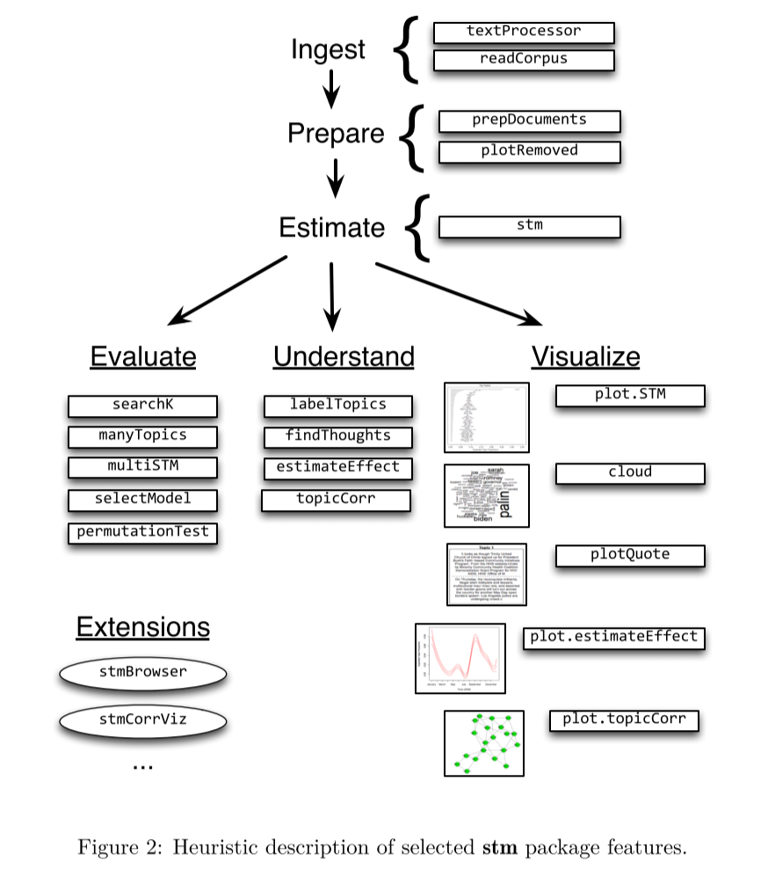
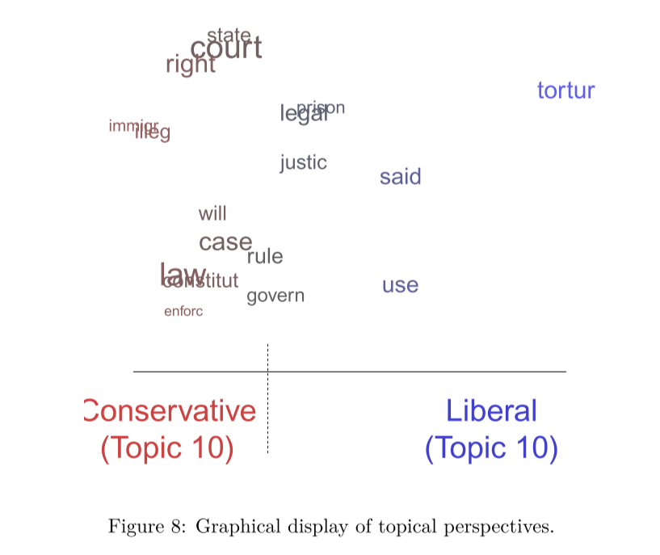

# README
## 目录结构
- `main.r`: 代码
- `data.csv`：London Steakhouse Co 餐厅的评论
- `Result.pdf`：程序输出
- `stmVignette.pdf`：所参考的stm例子
## 代码说明
主要参考了`stmVignette.pdf`中的例子，完成了下图中 `Ingest -> Prepare -> Estimate -> Visualize`的过程。

将 `mobile` 和 `not mobile` 的数据一起建立模型是受`stmVignette.pdf`中 `3.6` 节 `Visualize: Presenting STM results` 例子的启发，使用 `stm` 包的 `plot` 函数绘制图像来表示不同的评论方式对topic是如何贡献的。

此函数在文中的解释是：
>This function shows which words within a topic are more associated with one covariate value versus another.

图的含义在文中的表述是：
>Figure 8 indicates how liberals and conservatives talk about this topic differently.

